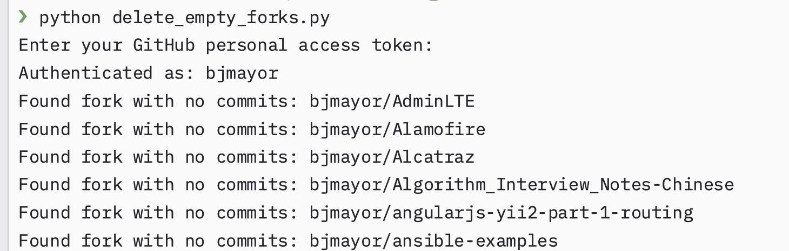
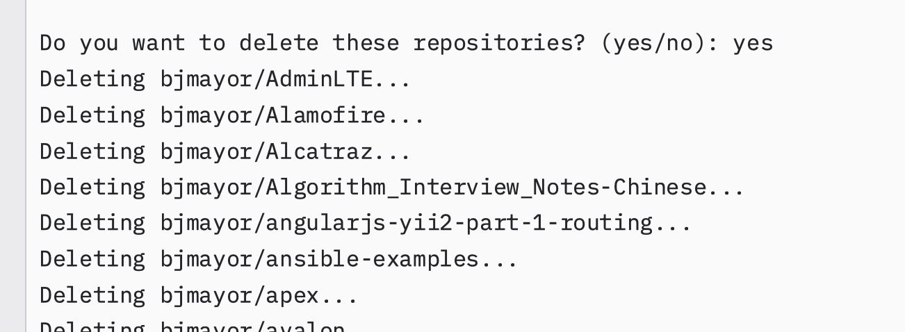

# delete_empty_forks

功能：删除所有fork的空仓库

我之前看到感兴趣的仓库，都会fork下来。导致这么多年下来堆积了很多，都掩盖了自己的仓库。

事实上，对一个项目感星期,star就行。
fork是为了提pr的。或者自己想改，就fork下来。加注释阅读也行。

 手动删了十来个感觉太麻烦了，就写了个脚本。
 PS: 其实是AI写的，时代变了，有啥想法让AI写就行。

## uv管理

```bash
uv venv
```

## 依赖安装

```bash
uv pip install PyGithub==2.1.1
```

## 运行

```bash
uv run python delete_empty_forks.py
```

## 使用方法

```bash
python delete_empty_forks.py
```

## 使用截图






## access_token 获取
获取 GitHub 个人访问令牌（Personal Access Token）的步骤

1. **登录到您的 GitHub 账户**
   首先，确保您已经登录到 GitHub 账户。

2. **进入设置页面**
   点击右上角的头像，然后在下拉菜单中选择 "Settings"（设置）。

3. **找到开发者设置**
   在左侧菜单栏的底部，点击 "Developer settings"（开发者设置）。

4. **访问个人访问令牌页面**
   在开发者设置页面的左侧菜单中，点击 "Personal access tokens"（个人访问令牌），然后选择 "Tokens (classic)"。

5. **生成新令牌**
   点击 "Generate new token"（生成新令牌）按钮，然后选择 "Generate new token (classic)"。

6. **验证身份**
   GitHub 可能会要求您再次输入密码以验证身份。

7. **设置令牌信息**
   - **Note（说明）**: 给令牌添加一个描述性名称，例如 "Delete Empty Forks"
   - **Expiration（有效期）**: 选择令牌的有效期限，可以是 7 天、30 天、60 天、90 天或自定义期限
   - **Scopes（权限范围）**: 这是最重要的部分，因为它决定了令牌可以执行的操作

8. **选择所需权限**
   对于删除仓库的操作，您需要勾选以下权限：
   - `delete_repo` - 允许删除仓库
   
   您也可以选择 `repo` 完整权限，它包含了所有仓库相关的操作权限，包括删除仓库。

9. **生成令牌**
   滚动到页面底部，点击 "Generate token"（生成令牌）按钮。

10. **保存令牌**
    **重要**: 生成后的令牌只会显示一次。请立即复制并保存在安全的地方，因为离开页面后将无法再次查看完整的令牌。